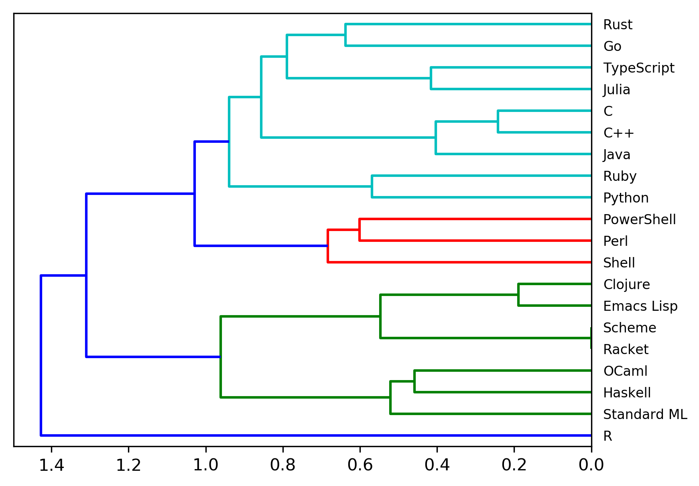
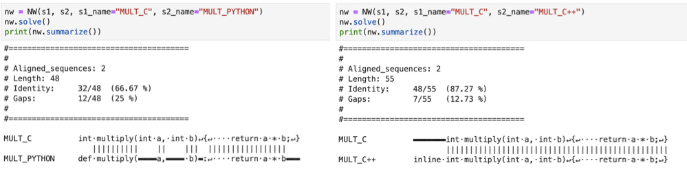

# Programming Language Phylogeny

Phylogenetic tree of programming languages constructed from code snippets

> STATUS: Early! In progress.

## Samples


Tree based on MULT "gene", ie `multiply(a, b) { return a * b}`


Jupyter Notebooks examples of aligning "sequences" with needleman-wunsch algorithm and computing similarity score.

## Setup

```bash
# create conda env
conda env create -f environment.yml

# activate
conda activate phylo

# install dev dependencies
pip install -r dev-requirements.txt

# run Jupyter Lab
jupyter lab
```

Alternatively...

```bash
conda env create -f full_env.yml
```

Also helpful:

```bash
# remove environemt
conda remove --name phylo --all

# export env to file
conda env export > full_env.yml
```
